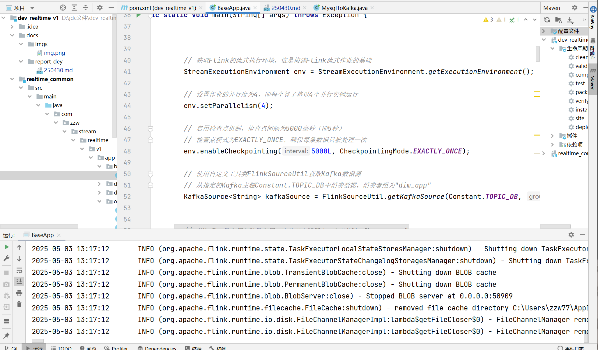
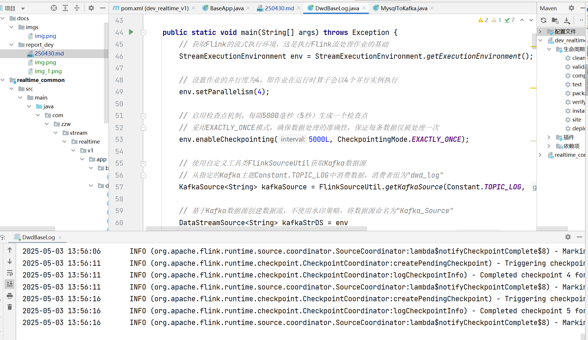
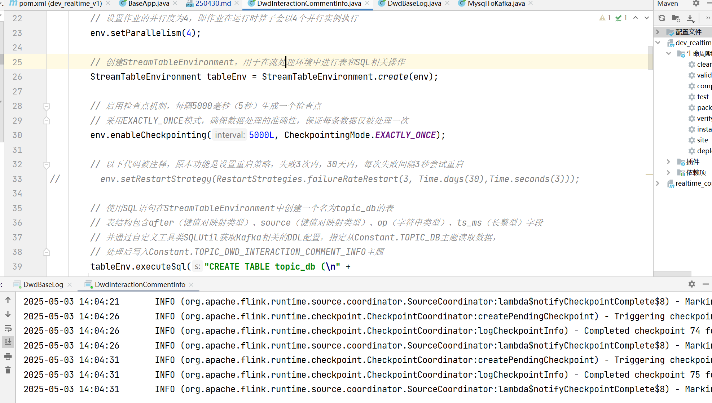
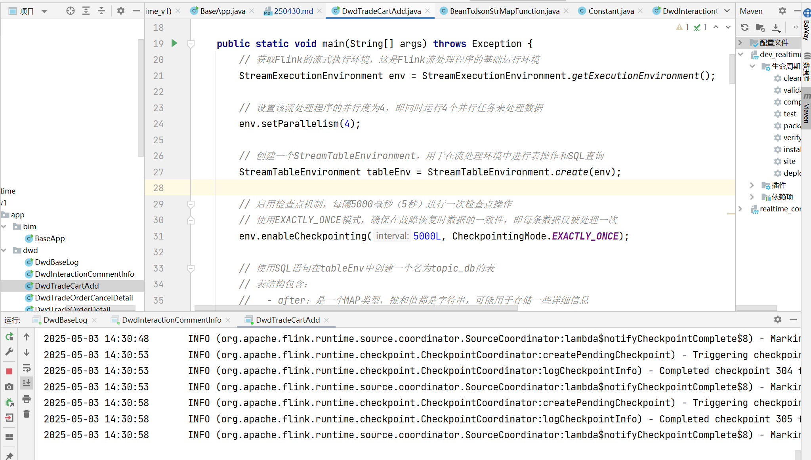
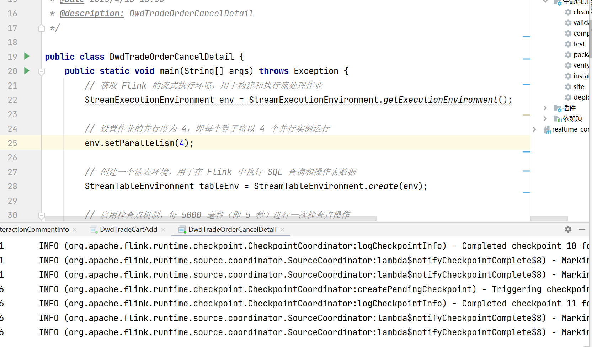
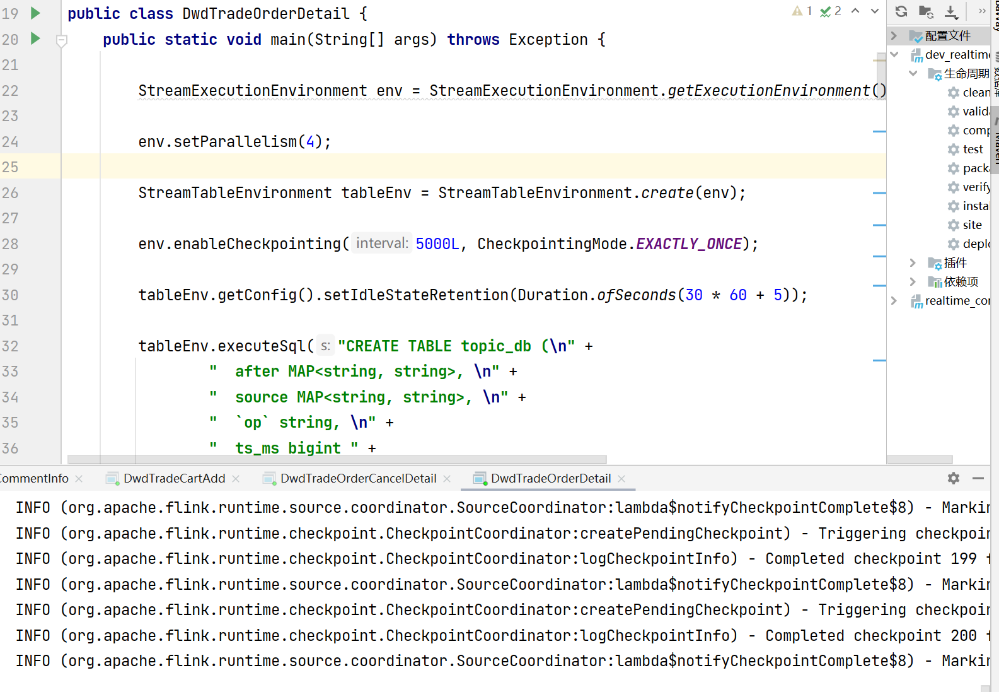
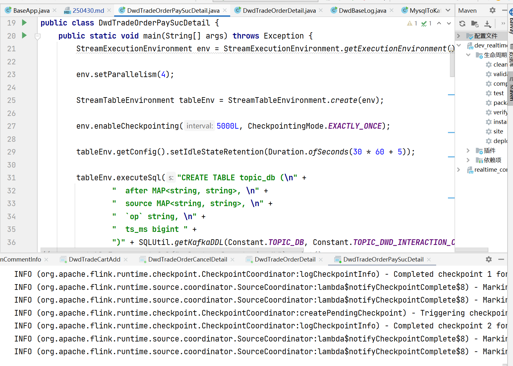
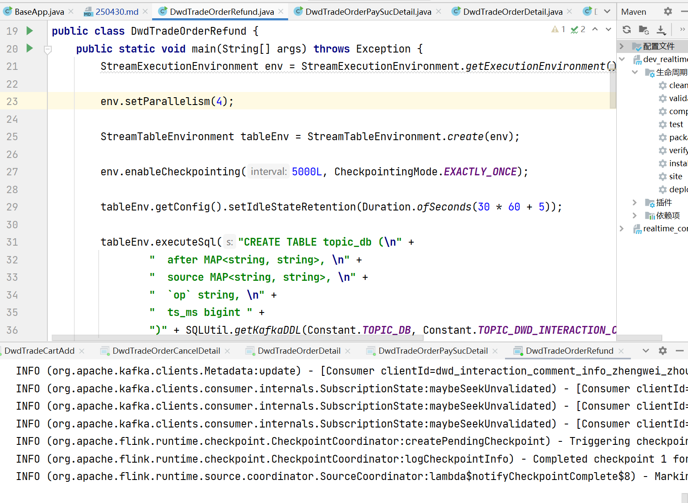
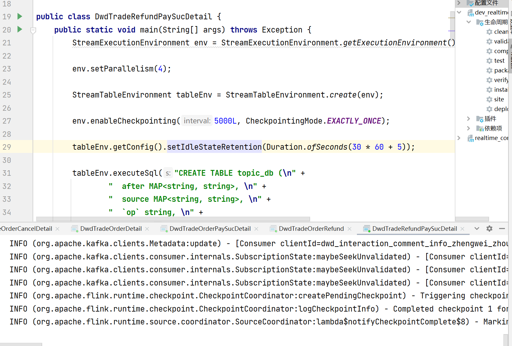

>250430
* flink 代码处理  提交  代码运行截图   如下

* ods   MysqlToKafka
> 

* dim   BaseApp
>

* dwd    
       DwdBaseLog
>

* DwdInteractionCommentInfo
>

* DwdTradeCartAdd
> 

* DwdTradeOrderCancelDetail
> 

* DwdTradeOrderDetail
> 

* DwdTradeOrderPaySucDetail
> 

* DwdTradeOrderRefund
> 

* DwdTradeRefundPaySucDetail
> 

